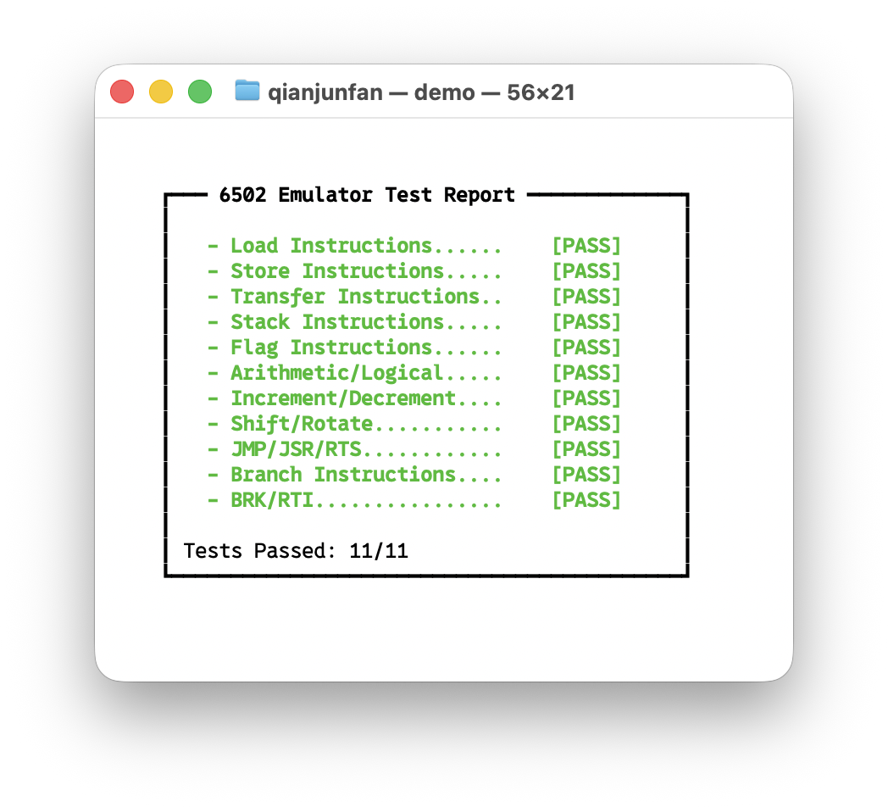
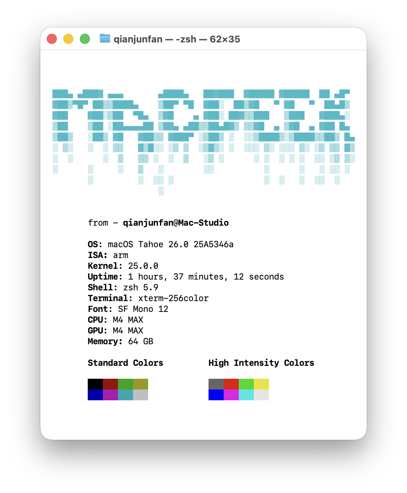
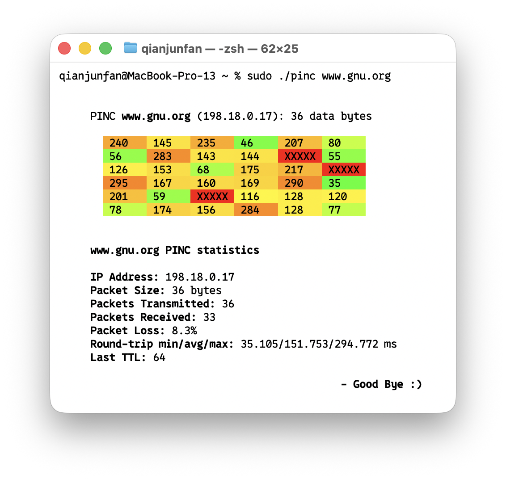

***
# My Side Projects⬇️

It's just a bunch of little programs I'm making for fun and practice, so the code isn't very good.😊

### 65c2 - 6502 Emulator in C
* **Description**: A pure C-language MOS6502 CPU emulator that can accurately simulate the processor's clock cycles and its legal instruction set. It also includes a self-written test case. (this project is an absolute slog :))
* **Status**: Complete ✅
* **Usage**:
    * **Compile**: `gcc 65c2.c -o 65c2`
    * **Run**: `./65c2` (test case)
   

### MacPeek - System Information Tool
* **Description**: A system information display tool for macOS, inspired by Neofetch.
* **Status**: Complete ✅
* **Usage**:
    * **Compile**: `gcc macpeek.c -o MacPeek`
    * **Run**: `./MacPeek`

### Pinc - A Simplified Ping Tool in C
* **Description**: A basic command-line network utility that sends ICMP packets to a specified host to check connectivity (for macOS).
* **Status**: Complete ✅
* **Usage**:
    * **Compile**: `gcc pinc.c -o pinc`
    * **Run**: `sudo ./pinc google.com`
    * **Note**: You will need `sudo` to create a raw socket for ICMP packet operations, and a terminal that supports 24-bit color is required.

## Contributing
Contributions and suggestions are welcome! Please open an issue to discuss any changes.
